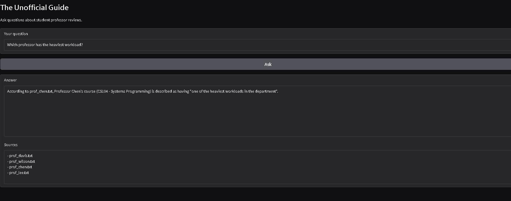
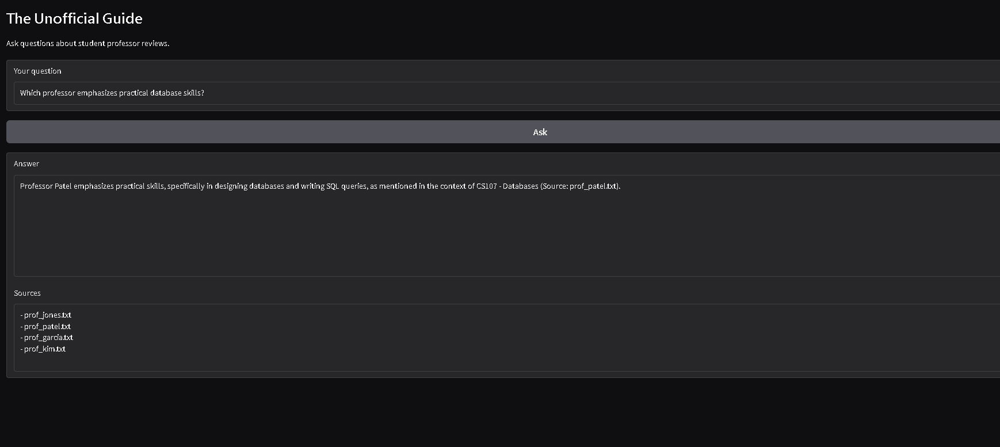
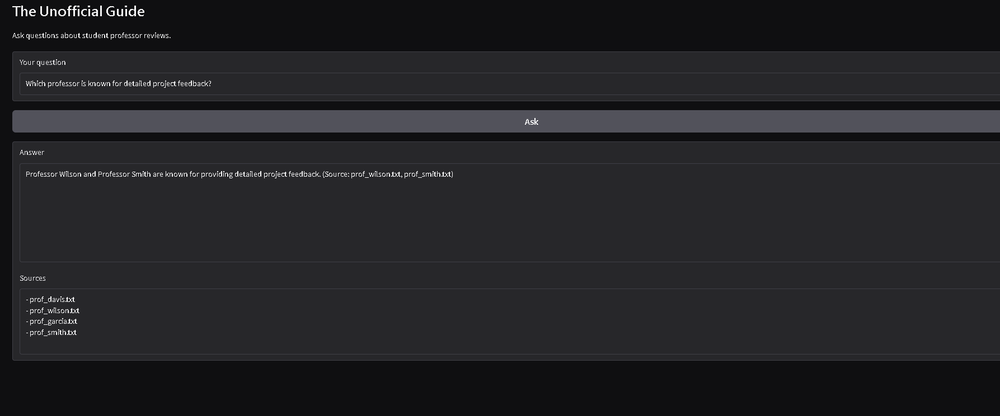
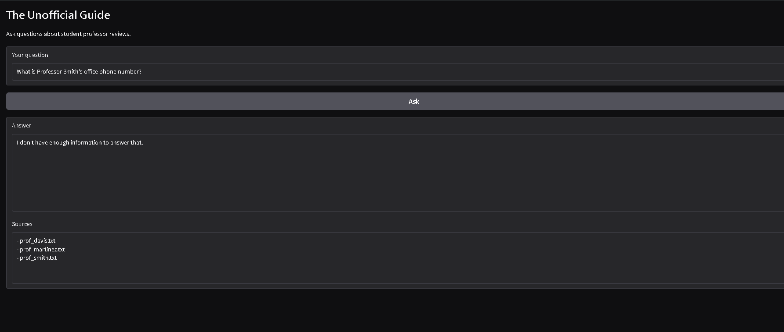
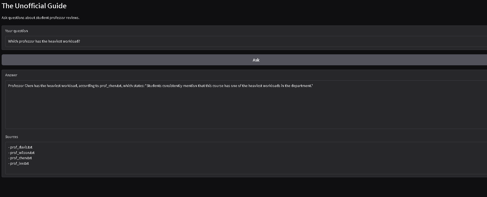

# The Unofficial Guide — Project 1

> **How to use this template:**
> Complete each section *after* you've built and tested the corresponding part of your system.
> Do not write placeholder text — if a section isn't done yet, leave it blank and come back.
> Every section below is required for submission. One-liners will not receive full credit.

---

## Domain

This project covers student-generated professor reviews for undergraduate computer science courses.

Official course catalogs provide course descriptions and instructor names, but they do not provide information about teaching style, workload, exam difficulty, project complexity, or student satisfaction. Students often rely on informal reviews to decide which courses to take. This system allows users to ask natural language questions about professor reviews and receive grounded answers supported by source documents.

---

## Document Sources

<!-- List every source you collected documents from.
     Be specific: include URLs, subreddit names, forum thread titles, or file names.
     Aim for variety — sources that together cover different subtopics or perspectives. -->

| # | Source | Type | URL or file path |
|---|--------|------|-----------------|
| 1 | Professor Smith Reviews | Text File | documents/prof_smith.txt |
| 2 | Professor Jones Reviews | Text File | documents/prof_jones.txt |
| 3 | Professor Lee Reviews | Text File | documents/prof_lee.txt |
| 4 | Professor Chen Reviews | Text File | documents/prof_chen.txt |
| 5 | Professor Kim Reviews | Text File | documents/prof_kim.txt |
| 6 | Professor Patel Reviews | Text File | documents/prof_patel.txt |
| 7 | Professor Davis Reviews | Text File | documents/prof_davis.txt |
| 8 | Professor Wilson Reviews | Text File | documents/prof_wilson.txt |
| 9 | Professor Martinez Reviews | Text File | documents/prof_martinez.txt |
| 10 | Professor Garcia Reviews | Text File | documents/prof_garcia.txt |

## Chunking Strategy

<!-- Describe your chunking approach with enough specificity that someone else could reproduce it.
     Include:
     - Chunk size (characters or tokens) and why that size fits your documents
     - Overlap size and why (or why not) you used overlap
     - Any preprocessing you did before chunking (e.g., stripping HTML, removing headers)
     - What your final chunk count was across all documents -->

**Chunk size:** 
300 characters

**Overlap:**  
50 characters

**Preprocessing:**
The documents were loaded from text files and split into chunks without major cleaning. Source filenames were preserved as metadata so they could be displayed during retrieval and source attribution.

**Why these choices fit your documents:** 
The documents consist of short review-style text rather than long articles. A chunk size of 300 characters keeps related review statements together while remaining small enough for precise retrieval. A 50-character overlap helps preserve context when information falls near chunk boundaries.

**Final chunk count:**
24 chunks

## Sample Chunks

### Chunk 1

**Source:** prof_chen.txt

```text
Professor Chen
Course: CS104 - Systems Programming

Students consistently mention that this course has one of the heaviest workloads in the department.

Programming projects are large and often require many hours outside class.

Several reviews mention spending entire weekends debugging assignments.
```

### Chunk 2

**Source:** prof_chen.txt

```text
on spending entire weekends debugging assignments.

Students generally agree that they learned a lot from the projects.

Office hours can be difficult to access because of high demand.

The course is considered valuable but time consuming.
```

### Chunk 3

**Source:** prof_davis.txt

```text
Professor Davis
Course: CS108 - Computer Networks

Students describe Professor Davis as organized and well prepared.

The course covers networking concepts in significant detail.

Several students mention that quizzes occur frequently.

Exams are not considered especially difficult, but consistent s
```

### Chunk 4

**Source:** prof_davis.txt

```text
considered especially difficult, but consistent studying is required.

Students often praise the lecture notes.

The workload is generally described as moderate.
```

### Chunk 5

**Source:** prof_garcia.txt

```text
Professor Garcia
Course: CS111 - Advanced Topics

Some students describe Garcia as one of the best professors in the department.

Other reviews say the course organization is confusing and assignment instructions are unclear.

Several students refer to the professor only as "G".
```

---

## Embedding Model

<!-- Name the embedding model you used and explain your choice.
     Then answer: if you were deploying this system for real users and cost wasn't a constraint,
     what tradeoffs would you weigh in choosing a different model?
     Consider: context length limits, multilingual support, accuracy on domain-specific text,
     latency, and local vs. API-hosted. -->

**Model used:** 
all-MiniLM-L6-v2 from sentence-transformers


**Production tradeoff reflection:** 
If this system were deployed for real users, I would compare larger embedding models that may provide better semantic retrieval accuracy. I would consider tradeoffs such as latency, hosting costs, multilingual support, context length, and whether the model can run locally or requires a hosted API.

---
## Retrieval Examples
**Query 1**

Query: Which professor has the heaviest workload?

Top Retrieved Sources:

prof_chen.txt
prof_davis.txt
prof_wilson.txt
prof_lee.txt

Why the retrieval was relevant:
The Chen chunk explicitly states that students describe the course as having one of the heaviest workloads in the department. The other retrieved chunks also discuss workload, making them semantically related even though they are not the strongest match.



**Query 2**

Query: Which professor emphasizes practical database skills?

Top Retrieved Sources:

prof_patel.txt

Why the retrieval was relevant:
The retrieved chunk discusses database concepts, practical applications, and industry-relevant skills, directly matching the query.



**Query 3**

Query: Which professor is known for detailed project feedback?

Top Retrieved Sources:

prof_wilson.txt

The retrieved chunk contains student comments about detailed feedback and project guidance, making it highly relevant to the question.



---

## Grounded Generation

<!-- Explain how your system enforces grounding — how does it prevent the LLM from answering
     beyond the retrieved documents?
     Describe both your system prompt (what instruction you gave the model) and any structural
     choices (e.g., how you formatted the context, whether you filtered low-relevance chunks).
     Do not just say "I told it to use the documents" — show the actual instruction or explain
     the mechanism. -->

**System prompt grounding instruction:** 
The prompt instructs the model to answer questions using only the retrieved context. If the answer is not present in the retrieved documents, the model is instructed to respond with: "I don't have enough information to answer that."

**How source attribution is surfaced in the response:**
Each retrieved chunk contains metadata identifying its source file. The application displays the source files used for retrieval alongside the generated answer.

---

## Grounded Generation Examples

**Example 1**

Question: Which professor has the heaviest workload?

*Response: Professor Chen has the heaviest workload according to prof_chen.txt.*

Sources Displayed:
- prof_chen.txt
- prof_davis.txt
- prof_wilson.txt
- prof_lee.txt

**Example 2**

Question: What do students think about Professor Garcia?

*Response: Student opinions are mixed and contradictory. Some students praise Garcia while others criticize the course organization.*

Sources Displayed:
- prof_garcia.txt

---

## Query Interface

The application uses a Gradio web interface.

Input:
- Natural language question about professor reviews.

Outputs:
- Generated answer.
- Source documents used during retrieval.
- Refusal response when information is not contained in the document.

---

## Out-of-Scope Query Example

Question: What is Professor Smith's office phone number?

*System Response:* I don't have enough information to answer that.



This demonstrates that the model refuses to answer questions that are not supported by the retrieved documents.

---

### Example Interface



---

## Evaluation Report

<!-- Run your 5 test questions from planning.md through your system and record the results.
     Be honest — a partially accurate or inaccurate result that you explain well is more
     valuable than a suspiciously perfect result. -->

| # | Question | Expected answer | System response (summarized) | Retrieval quality | Response accuracy |
|---|----------|-----------------|------------------------------|-------------------|-------------------|
| 1 | Which professor is considered most beginner friendly? | Professor Smith | Identified Professor Smith as beginner friendly | Relevant | Accurate |
| 2 | Which professor has the heaviest workload? | Professor Chen | Identified Professor Chen as having the heaviest workload | Relevant | Accurate |
| 3 | Which professor emphasizes practical database skills? | Professor Patel | Identified Professor Patel and referenced SQL/database skills | Relevant | Accurate |
| 4 | Which professor is known for detailed project feedback? | Professor Wilson | Identified Wilson and Smith as providing detailed project feedback | Relevant | Partially Accurate |
| 5 | What do students think about Professor Garcia? | Mixed opinions | Identified mixed and contradictory opinions | Relevant | Accurate |

**Retrieval quality:** Relevant / Partially relevant / Off-target  
**Response accuracy:** Accurate / Partially accurate / Inaccurate

---

## Failure Case Analysis

<!-- Identify at least one question where retrieval or generation did not work as expected.
     Write a specific explanation of *why* it failed, tied to a part of the pipeline.

     "The answer was wrong" is not an explanation.

     "The relevant information was split across a chunk boundary, so retrieval returned
     only half the context — the model didn't have enough to answer correctly" is an explanation.

     "The embedding model treated the professor's nickname as out-of-vocabulary and returned
     results from an unrelated review" is an explanation. -->

**Question that failed:**
"Which professor has the heaviest workload?"

**What the system returned:**
Returned the correct answer, but also returned sources that also included professors with moderate workloads such as Davis and Lee. This occurred because semantic retrieval returned generally workload-related chunks rather than exclusively the strongest match.

**Root cause (tied to a specific pipeline stage):**
This occurred because semantic retrieval returned generally workload-related chunks rather than exclusively the strongest match. The generation step corrected the final answer because the Chen chunk contained stronger evidence.

**What you would change to fix it:**
A possible improvement would be reranking retrieved chunks or increasing the corpus size to better distinguish workload intensity.

---

## Spec Reflection

<!-- Reflect on how planning.md shaped your implementation.
     Answer both questions with at least 2–3 sentences each. -->

**One way the spec helped you during implementation:**
The planning document helped me organize the project before writing code. Defining the document sources, chunking strategy, retrieval approach, and evaluation questions ahead of time made it easier to implement each stage of the RAG pipeline in a structured way.

**One way your implementation diverged from the spec, and why:**
I originally expected retrieval to consistently rank the strongest matching chunk first. During testing, semantically related chunks were sometimes returned alongside the best match. The generation stage still produced accurate answers because the relevant evidence was present in the retrieved context.

---

## AI Usage

<!-- Describe at least 2 specific instances where you used an AI tool during this project.
     For each: what did you give the AI as input, what did it produce, and what did you
     change, override, or direct differently?

     "I used Claude to help me code" is not sufficient.
     "I gave Claude my Chunking Strategy section from planning.md and asked it to implement
     chunk_text(). It returned a function using a fixed character split. I overrode the
     chunk size from 500 to 200 because my documents are short reviews, not long guides." -->

**Instance 1**
- *What I gave the AI:* My project requirements and chunking plan from planning.md.
- *What it produced:* Suggestions for implementing document ingestion and chunking functions.
- *What I changed or overrode:* I selected the chunk size and overlap values based on the structure of my professor review documents. I tested the chunk output myself and verified that important review information remained together after chunking.

**Instance 2**
- *What I gave the AI:* Questions about integrating ChromaDB, embeddings, and retrieval into the project pipeline.
- *What it produced:* Example code snippets and troubleshooting suggestions for retrieval and query processing.
- *What I changed or overrode:* I modified the code to work with my document set, tested retrieval quality using multiple queries, fixed errors encountered during development, and evaluated whether the retrieved results were relevant before incorporating changes into the final project.