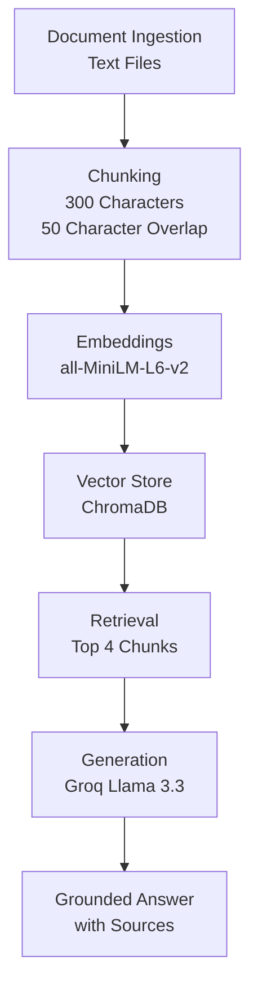

# Project 1 Planning: The Unofficial Guide

## Domain

Student-generated professor reviews for undergraduate computer science courses.

Official course catalogs provide course descriptions and instructor names, but they do not contain student opinions about teaching style, workload, exam difficulty, feedback quality, or overall course experience. This system makes professor reviews searchable and answerable through natural language questions.

---

## Documents

1. prof_smith.txt
2. prof_jones.txt
3. prof_lee.txt
4. prof_chen.txt
5. prof_kim.txt
6. prof_patel.txt
7. prof_davis.txt
8. prof_wilson.txt
9. prof_martinez.txt
10. prof_garcia.txt

Each document contains simulated student review text for a computer science professor and course.

---

## Chunking Strategy

**Chunk size:** 300 characters

**Overlap:** 50 characters

**Reasoning:**

Professor review documents are relatively short and opinion-based. Smaller chunks help keep each chunk focused on a specific student opinion, making retrieval more precise. A 50-character overlap helps preserve context when information spans multiple chunks.

---

## Retrieval Approach

**Embedding model:** all-MiniLM-L6-v2 using sentence-transformers

**Top-k:** 4 chunks per query

**Production tradeoff reflection:**

For a production system, I would evaluate larger embedding models that may provide higher retrieval accuracy, longer context handling, multilingual support, and better performance on informal student language. I would balance those benefits against increased cost, latency, and infrastructure requirements.

---

## Evaluation Plan

| # | Question                                                | Expected answer                                                                                                |
| - | ------------------------------------------------------- | -------------------------------------------------------------------------------------------------------------- |
| 1 | Which professor is considered most beginner friendly?   | Professor Smith                                                                                                |
| 2 | Which professor has the heaviest workload?              | Professor Chen                                                                                                 |
| 3 | Which professor emphasizes practical database skills?   | Professor Patel                                                                                                |
| 4 | Which professor is known for detailed project feedback? | Professor Wilson                                                                                               |
| 5 | What do students think about Professor Garcia?          | Mixed opinions with conflicting reviews; possible retrieval issues because some reviews refer to Garcia as "G" |

---

## Anticipated Challenges

1. Important information may be split across chunk boundaries, causing retrieval to miss part of an answer.

2. Semantic retrieval may return reviews discussing similar topics but the wrong professor.

3. Source attribution could fail if metadata is not stored correctly during ingestion.

4. The Garcia document contains conflicting opinions and a nickname ("G"), which may create retrieval or generation errors.

---

## Architecture



---

## AI Tool Plan

**Milestone 3 — Ingestion and Chunking**

I will use ChatGPT to help generate Python code that loads text files from the documents folder, cleans whitespace, and chunks documents according to my specified chunk size and overlap. I will verify the output by inspecting sample chunks and confirming that each chunk contains meaningful review information and correct source metadata.

**Milestone 4 — Embedding and Retrieval**

I will use ChatGPT to help implement embeddings using all-MiniLM-L6-v2 and store chunk embeddings in ChromaDB. I will verify retrieval quality by running evaluation questions and checking whether the returned chunks are relevant to the query.

**Milestone 5 — Generation and Interface**

I will use ChatGPT to help connect retrieval to Groq's Llama model and build a Gradio interface. I will verify grounding by ensuring answers come only from retrieved documents and that out-of-scope questions return an appropriate response indicating insufficient information.

```
```
